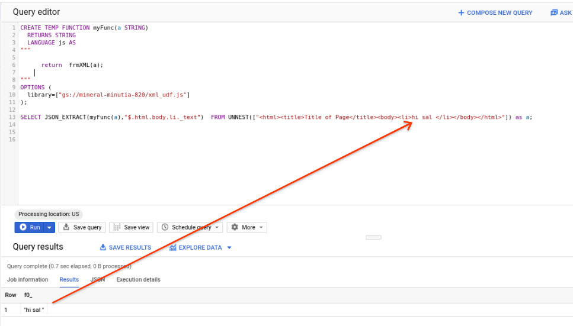

### XML parsing with BigQuery UDF

Simple [BigQuery User Defined Function](https://cloud.google.com/bigquery/docs/reference/standard-sql/user-defined-functions) (`UDF`) that wil parse a **well-formed** XML bigquery `STRING` column into JSON.

The specific library used in this example to parse XML to JSON is [xml-js](https://www.npmjs.com/package/xml-js)

This is an extension of a [StackOverfow post](https://stackoverflow.com/questions/48954109/is-there-a-way-to-parse-xml-tags-in-bigquery-standard-sql) I came across recently.  The specific extension is to further parse the output using standard [BigQuer JSON](https://cloud.google.com/bigquery/docs/reference/standard-sql/json_functions#jsonpath_format) functions to extract specific fields.


#### Setup

You can either build the UDF or use the one in this repo `xml_udf.js`

To use the provided one, simply make a copy of it and place it into a GCS bucket in your project

To build, you'll need `nodejs`

```bash
cd webpack-demo/
npm init -y
npm install webpack webpack-cli --save-dev
npm install --save xml-js
```

The actual code that does the UDF is at `webpack-demo/src/index.ts`

```javascript
var convert = require('xml-js');

module.exports.XML2JSON = function (xml) {
    return convert.xml2json(xml, {compact: true, spaces: 4});
}

module.exports.JSON2XML = function (json) {
    var options = {compact: true, ignoreComment: true, spaces: 4};
    return convert.json2xml(json, options);
}
```

Then build the webpack

```bash
npx webpack --config webpack.config.js 
```

Edit the file `xml_udf.js` and add the contents of the webpack 


```javascript
---> contents of webpack-demo/dist/main.js <---

function frmXML(d) {
    c = xmllib.XML2JSON(d);
    return c;
}
```

Upload the file and finally, use the UDF


```
CREATE TEMP FUNCTION myFunc(a STRING)
  RETURNS STRING  
  LANGUAGE js AS
"""  
      return  frmXML(a);
"""    
OPTIONS (
  library=["gs://mineral-minutia-820/xml_udf.js"]
);

SELECT JSON_EXTRACT(myFunc(a),"$.html.body.li._text")  FROM UNNEST(["<html><title>Title of Page</title><body><li>hi sal </li></body></html>"]) as a;
```

Note the output of the UDF is JSON which i've parse out to extract just one field (`hi sal`):




### Alternative XML Parsing

You can also use the following XML Parsers in your own UDF:

- [https://github.com/kawanet/from-xml](https://github.com/kawanet/from-xml)
  (or the inverse [to-xm](https://github.com/kawanet/to-xml))
- [sax-js](https://github.com/isaacs/sax-js)

#### XSLT Support

This sample does not utilize XLST.  Trust me, you don't want to go there...but if you do, see [fiduswriter/xslt-processor](https://github.com/fiduswriter/xslt-processor)
